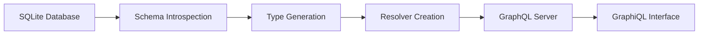

# graph-sql

A lightweight GraphQL server that automatically introspects your SQLite database
and generates a type-safe GraphQL schema with zero configuration.

## 🚀 Features

- **Zero Configuration**: Automatically introspects your SQLite database
  structure
- **Full CRUD Operations**: Complete Create, Read, Update, Delete support
  through GraphQL mutations and queries
- **Type-Safe Schema**: Generates GraphQL types that match your database schema
- **Dynamic Schema Generation**: Creates resolvers and types at runtime
- **Built-in GraphiQL**: Interactive GraphQL playground included
- **Fast & Lightweight**: Built with Rust for optimal performance
- **SQLite Focus**: Optimized specifically for SQLite databases

## 📋 Prerequisites

- Rust 1.86.0+ (2024 edition)
- SQLite database

## 🛠️ Installation

### From Source

```bash
git clone https://github.com/karlrobeck/graph-sql.git
cd graph-sql
cargo build --release
```

### Using Cargo (from Git)

```bash
cargo install --git https://github.com/karlrobeck/graph-sql.git
```

## 🚀 Quick Start

1. **Prepare your SQLite database** with some tables and data
2. **Run the server**:
   ```bash
   cargo run
   ```
3. **Open GraphiQL** at `http://localhost:8000`
4. **Start querying and mutating** your database with GraphQL!

## 📖 How It Works

graph-sql follows a simple workflow:



1. **Introspection**: Analyzes your SQLite database schema using `PRAGMA`
   statements
2. **Type Generation**: Creates GraphQL types based on table columns and their
   SQLite types
3. **Resolver Creation**: Generates dynamic resolvers for querying and mutating
   data
4. **Server Launch**: Starts an Axum-based GraphQL server with GraphiQL

## 🏗️ GraphQL Schema Structure

graph-sql uses a unique nested structure where each table becomes a top-level
query field that contains `list` and `view` operations:

```graphql
type Query {
  tableName: tableName_node
}

type tableName_node {
  # Table columns as fields
  column1: Type
  column2: Type
  
  # Query operations
  list(input: list_tableName_input!): [tableName_node]
  view(input: view_tableName_input!): tableName_node
}
```

This structure allows for intuitive querying where you can:

- **Navigate to a table**: `query { cake { ... } }`
- **List multiple records**:
  `cake { list(input: {page: 1, limit: 10}) { ... } }`
- **View specific record**: `cake { view(input: {id: 3}) { ... } }`
- **Combine operations**: Get both list and specific views in a single query

## 🗄️ Database Schema Mapping

graph-sql automatically maps SQLite types to GraphQL types:

| SQLite Type | GraphQL Type | Notes                     |
| ----------- | ------------ | ------------------------- |
| `INTEGER`   | `Int`        | Including `AUTOINCREMENT` |
| `TEXT`      | `String`     | All text-based fields     |
| `REAL`      | `Float`      | Floating point numbers    |
| `BLOB`      | `String`     | Binary data as string     |
| `NUMERIC`   | `String`     | Custom numeric types      |

### Nullability

- Columns with `NOT NULL` constraint → Non-nullable GraphQL fields
- Nullable columns → Nullable GraphQL fields

## 📊 Example Usage

Given this SQLite schema:

```sql
CREATE TABLE cake(
  id INTEGER NOT NULL PRIMARY KEY AUTOINCREMENT,
  name TEXT NOT NULL,
  price REAL,
  is_vegan INTEGER,
  created_at TEXT,
  description TEXT
);

CREATE TABLE filling(
  id INTEGER NOT NULL PRIMARY KEY AUTOINCREMENT,
  name TEXT NOT NULL,
  calories INTEGER,
  fat REAL
);
```

graph-sql generates this GraphQL schema:

```graphql
type Query {
  cake: cake_node
  filling: filling_node
}

type Mutation {
  insert_cake(input: insert_cake_input!): cake_node!
  update_cake(id: Int!, input: update_cake_input!): cake_node!
  delete_cake(id: Int!): DeleteResult!
  insert_filling(input: insert_filling_input!): filling_node!
  update_filling(id: Int!, input: update_filling_input!): filling_node!
  delete_filling(id: Int!): DeleteResult!
}

type cake_node {
  id: Int!
  name: String!
  price: Float
  is_vegan: Int
  created_at: String
  description: String
  list(input: list_cake_input!): [cake_node]
  view(input: view_cake_input!): cake_node
}

type filling_node {
  id: Int!
  name: String!
  calories: Int
  fat: Float
  list(input: list_filling_input!): [filling_node]
  view(input: view_filling_input!): filling_node
}

input insert_cake_input {
  name: String!
  price: Float
  is_vegan: Int
  created_at: String
  description: String
}

input update_cake_input {
  name: String
  price: Float
  is_vegan: Int
  created_at: String
  description: String
}

input list_cake_input {
  page: Int!
  limit: Int!
}

input view_cake_input {
  id: Int!
}

type DeleteResult {
  rows_affected: Int!
}
```

### Example Queries

```graphql
# Get all cakes with pagination
query {
  cake {
    list(input: { page: 1, limit: 10 }) {
      id
      name
      price
      is_vegan
    }
  }
}

# Get specific cake by ID
query {
  cake {
    view(input: { id: 3 }) {
      id
      name
      description
      price
    }
  }
}

# Get fillings with nutritional info
query {
  filling {
    list(input: { page: 1, limit: 5 }) {
      name
      calories
      fat
    }
  }
}

# Complex query combining both tables
query {
  cake {
    list(input: { page: 1, limit: 10 }) {
      id
      name
      price
      is_vegan
    }
    view(input: { id: 3 }) {
      id
      name
      description
    }
  }
  filling {
    list(input: { page: 1, limit: 5 }) {
      name
      calories
    }
  }
}
```

### Example Mutations

```graphql
# Insert a new cake
mutation {
  insert_cake(input: {
    name: "Chocolate Cake"
    price: 25.99
    is_vegan: 0
    description: "Rich chocolate cake with ganache"
  }) {
    id
    name
  }
}

# Update an existing cake
mutation {
  update_cake(id: 1, input: {
    price: 29.99
    description: "Premium chocolate cake with ganache"
  }) {
    id
    name
    price
  }
}

# Delete a cake
mutation {
  delete_cake(id: 1) {
    rows_affected
  }
}

# Insert a new filling
mutation {
  insert_filling(input: {
    name: "Vanilla Cream"
    calories: 150
    fat: 8.5
  }) {
    id
    name
  }
}
```

## ⚙️ Configuration

### Database Connection

By default, graph-sql uses an in-memory SQLite database. To use your own
database:

```rust
// Modify src/main.rs
let db = SqlitePool::connect("sqlite:///path/to/your/database.db").await?;
```

### Server Port

The server runs on `localhost:8000` by default. To change:

```rust
// Modify src/main.rs
let listener = TcpListener::bind("0.0.0.0:3000").await?;
```

### Excluded Tables

System tables are automatically excluded:

- `_sqlx_migrations`
- `sqlite_sequence`

## 🏗️ Architecture

### Core Components

- **`main.rs`**: Server setup, schema building, and routing
- **`types.rs`**: Database introspection and GraphQL type mapping
- **`resolvers.rs`**: Dynamic resolvers for full CRUD operations
- **`traits.rs`**: Trait definitions for type conversions

### Key Dependencies

- **`async-graphql`**: GraphQL implementation with dynamic schema support
- **`sqlx`**: Async SQLite driver with compile-time checked queries
- **`axum`**: Modern async web framework
- **`tokio`**: Async runtime
- **`sea-query`**: SQL query builder for dynamic query generation
- **`sqlx`**: Async SQLite driver with compile-time checked queries
- **`axum`**: Modern async web framework
- **`tokio`**: Async runtime

## 🔧 Development

### Running Tests

```bash
cargo test
```

### Running with Sample Data

The project includes a sample bakery database schema in `migrations/`:

```bash
cargo run
```

This will:

1. Create an in-memory database
2. Run migrations to create sample tables
3. Start the GraphQL server
4. Open GraphiQL at `http://localhost:8000`

### Database Migrations

Migrations are stored in the `migrations/` directory and automatically run on
startup:

```
migrations/
├── 20250730201446_bakery.up.sql   # Create tables
└── 20250730201446_bakery.down.sql # Drop tables
```

## 🚧 Current Limitations

- **SQLite only**: Designed specifically for SQLite databases
- **No relationships**: Foreign key relationships not yet mapped to GraphQL
- **Simple types**: Complex SQLite types map to basic GraphQL types
- **Basic pagination**: List queries use simple page/limit pagination
- **No subscriptions**: Real-time updates not yet supported
- **Primary key restriction**: Only `i64` (INTEGER) primary keys are currently
  supported

## 🛣️ Roadmap

- [x] **Mutations support**: INSERT, UPDATE, DELETE operations ✅
- [ ] **Relationship mapping**: Foreign keys → GraphQL relationships
- [ ] **Subscriptions**: Real-time updates
- [ ] **Advanced filtering**: WHERE clauses and complex query conditions
- [ ] **Improved pagination**: Cursor-based pagination and sorting
- [ ] **Custom resolvers**: Plugin system for custom business logic
- [ ] **Multiple databases**: PostgreSQL and MySQL support
- [ ] **Authentication**: Built-in auth layer
- [ ] **Caching**: Query result caching

## 🤝 Contributing

Contributions are welcome! Please feel free to submit a Pull Request.

1. Fork the repository
2. Create your feature branch (`git checkout -b feature/amazing-feature`)
3. Commit your changes (`git commit -m 'Add amazing feature'`)
4. Push to the branch (`git push origin feature/amazing-feature`)
5. Open a Pull Request

## 📝 License

This project is licensed under the MIT OR Apache-2.0 License - see the
[LICENSE](LICENSE) file for details.

## 🙏 Acknowledgments

- Built with [async-graphql](https://github.com/async-graphql/async-graphql)
- Powered by [SQLx](https://github.com/launchbadge/sqlx)
- Web framework by [Axum](https://github.com/tokio-rs/axum)
- Query building with [SeaQuery](https://github.com/SeaQL/sea-query)

## 📞 Support

- Create an [issue](https://github.com/karlrobeck/graph-sql/issues) for bug
  reports
- Start a [discussion](https://github.com/karlrobeck/graph-sql/discussions) for
  questions

---

**graph-sql** - Turning your SQLite database into a full-featured GraphQL API,
effortlessly.
