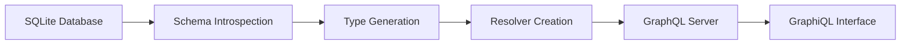

# graph-sql

A lightweight GraphQL server that automatically introspects your SQLite database
and generates a type-safe GraphQL schema with zero configuration.

## 🚀 Features

- **Zero Configuration**: Automatically introspects your SQLite database
  structure
- **Type-Safe Schema**: Generates GraphQL types that match your database schema
- **Dynamic Schema Generation**: Creates resolvers and types at runtime
- **Built-in GraphiQL**: Interactive GraphQL playground included
- **Fast & Lightweight**: Built with Rust for optimal performance
- **SQLite Focus**: Optimized specifically for SQLite databases

## 📋 Prerequisites

- Rust 1.75+ (2024 edition)
- SQLite database

## 🛠️ Installation

### From Source

```bash
git clone https://github.com/karlrobeck/graph-sql.git
cd graph-sql
cargo build --release
```

### Using Cargo

```bash
cargo install graph-sql
```

## 🚀 Quick Start

1. **Prepare your SQLite database** with some tables and data
2. **Run the server**:
   ```bash
   cargo run
   ```
3. **Open GraphiQL** at `http://localhost:8000`
4. **Start querying** your database with GraphQL!

## 📖 How It Works

graph-sql follows a simple workflow:



1. **Introspection**: Analyzes your SQLite database schema using `PRAGMA`
   statements
2. **Type Generation**: Creates GraphQL types based on table columns and their
   SQLite types
3. **Resolver Creation**: Generates dynamic resolvers for querying data
4. **Server Launch**: Starts an Axum-based GraphQL server with GraphiQL

## 🗄️ Database Schema Mapping

graph-sql automatically maps SQLite types to GraphQL types:

| SQLite Type | GraphQL Type | Notes                     |
| ----------- | ------------ | ------------------------- |
| `INTEGER`   | `Int`        | Including `AUTOINCREMENT` |
| `TEXT`      | `String`     | All text-based fields     |
| `REAL`      | `Float`      | Floating point numbers    |
| `BLOB`      | `String`     | Binary data as string     |
| `NUMERIC`   | `String`     | Custom numeric types      |

### Nullability

- Columns with `NOT NULL` constraint → Non-nullable GraphQL fields
- Nullable columns → Nullable GraphQL fields

## 📊 Example Usage

Given this SQLite schema:

```sql
CREATE TABLE cake(
  id INTEGER NOT NULL PRIMARY KEY AUTOINCREMENT,
  name TEXT NOT NULL,
  price REAL,
  is_vegan INTEGER,
  created_at TEXT,
  description TEXT
);

CREATE TABLE filling(
  id INTEGER NOT NULL PRIMARY KEY AUTOINCREMENT,
  name TEXT NOT NULL,
  calories INTEGER,
  fat REAL
);
```

graph-sql generates this GraphQL schema:

```graphql
type Query {
  cake: [Cake]
  filling: [Filling]
}

type Cake {
  id: Int!
  name: String!
  price: Float
  is_vegan: Int
  created_at: String
  description: String
}

type Filling {
  id: Int!
  name: String!
  calories: Int
  fat: Float
}
```

### Example Queries

```graphql
# Get all cakes
query {
  cake {
    id
    name
    price
    is_vegan
  }
}

# Get specific cake fields
query {
  cake {
    name
    description
  }
}

# Get fillings with nutritional info
query {
  filling {
    name
    calories
    fat
  }
}
```

## ⚙️ Configuration

### Database Connection

By default, graph-sql uses an in-memory SQLite database. To use your own
database:

```rust
// Modify src/main.rs
let db = SqlitePool::connect("sqlite:///path/to/your/database.db").await?;
```

### Server Port

The server runs on `localhost:8000` by default. To change:

```rust
// Modify src/main.rs
let listener = TcpListener::bind("0.0.0.0:3000").await?;
```

### Excluded Tables

System tables are automatically excluded:

- `_sqlx_migrations`
- `sqlite_sequence`

## 🏗️ Architecture

### Core Components

- **`main.rs`**: Server setup, schema building, and routing
- **`types.rs`**: Database introspection and GraphQL type mapping
- **`resolvers.rs`**: Dynamic resolvers for data fetching

### Key Dependencies

- **`async-graphql`**: GraphQL implementation with dynamic schema support
- **`sqlx`**: Async SQLite driver with compile-time checked queries
- **`axum`**: Modern async web framework
- **`tokio`**: Async runtime

## 🔧 Development

### Running Tests

```bash
cargo test
```

### Running with Sample Data

The project includes a sample bakery database schema in `migrations/`:

```bash
cargo run
```

This will:

1. Create an in-memory database
2. Run migrations to create sample tables
3. Start the GraphQL server
4. Open GraphiQL at `http://localhost:8000`

### Database Migrations

Migrations are stored in the `migrations/` directory and automatically run on
startup:

```
migrations/
├── 20250730201446_bakery.up.sql   # Create tables
└── 20250730201446_bakery.down.sql # Drop tables
```

## 🚧 Current Limitations

- **Read-only**: Currently supports queries only (no mutations or subscriptions)
- **SQLite only**: Designed specifically for SQLite databases
- **No relationships**: Foreign key relationships not yet mapped to GraphQL
- **Simple types**: Complex SQLite types map to basic GraphQL types

## 🛣️ Roadmap

- [ ] **Mutations support**: INSERT, UPDATE, DELETE operations
- [ ] **Relationship mapping**: Foreign keys → GraphQL relationships
- [ ] **Subscriptions**: Real-time updates
- [ ] **Filtering & pagination**: WHERE clauses and LIMIT/OFFSET
- [ ] **Custom resolvers**: Plugin system for custom business logic
- [ ] **Multiple databases**: PostgreSQL and MySQL support
- [ ] **Authentication**: Built-in auth layer
- [ ] **Caching**: Query result caching

## 🤝 Contributing

Contributions are welcome! Please feel free to submit a Pull Request.

1. Fork the repository
2. Create your feature branch (`git checkout -b feature/amazing-feature`)
3. Commit your changes (`git commit -m 'Add amazing feature'`)
4. Push to the branch (`git push origin feature/amazing-feature`)
5. Open a Pull Request

## 📝 License

This project is licensed under the MIT License - see the [LICENSE](LICENSE) file
for details.

## 🙏 Acknowledgments

- Built with [async-graphql](https://github.com/async-graphql/async-graphql)
- Powered by [SQLx](https://github.com/launchbadge/sqlx)
- Web framework by [Axum](https://github.com/tokio-rs/axum)

## 📞 Support

- Create an [issue](https://github.com/karlrobeck/graph-sql/issues) for bug
  reports
- Start a [discussion](https://github.com/karlrobeck/graph-sql/discussions) for
  questions

---

**graph-sql** - Turning your SQLite database into a GraphQL API, effortlessly.
