# graph-sql

A Rust library that automatically introspects your SQLite database and generates a complete GraphQL API with zero configuration. Perfect for rapid prototyping, admin panels, and turning existing databases into modern GraphQL services.

For detailed documentation and more queries, see the [examples directory](./examples/).

## 🔧 Library API

graph-sql provides a simple, elegant API for integrating GraphQL into your Rust applications:

### **Core Functions**

```rust
// Main introspection function I created
pub async fn introspect(pool: &SqlitePool) -> Result<SchemaBuilder, Error>

// Schema builder for customization
impl SchemaBuilder {
    pub fn finish(self) -> Result<Schema<Query, Mutation, EmptySubscription>, Error>
    // Additional customization methods available
}
```

### **Integration Patterns**

**🔥 Minimal Setup** (3 lines):
```rust
let db = SqlitePool::connect("sqlite://app.db").await?;
let schema = graph_sql::introspect(&db).await?.finish()?;
let app = Router::new().route("/graphql", post_service(GraphQL::new(schema)));
```

**🛠️ With Custom Configuration**:
```rust
let schema = graph_sql::introspect(&db)
    .await?
    // Add custom resolvers, middleware, etc.
    .finish()?;
```

**🔄 With Hot Reloading** (Development):
```rust
// Reintrospect when schema changes
let schema = graph_sql::introspect(&db).await?.finish()?;
```

### **Framework Integration**

graph-sql works seamlessly with popular Rust web frameworks:

- **Axum** ✅ (shown in examples)
- **Actix-web** ✅ (via async-graphql-actix-web)
- **Warp** ✅ (via async-graphql-warp)
- **Tide** ✅ (via async-graphql-tide)

### **Use Cases**

Perfect for:
- 🚀 **Rapid prototyping** - Turn any SQLite DB into a GraphQL API instantly
- 🛠️ **Admin panels** - Auto-generated CRUD interfaces for content management
- 📊 **Data exploration** - Interactive GraphiQL interface for database exploration
- 🔄 **Legacy modernization** - Add GraphQL layer to existing SQLite applications
- 🧪 **Testing & development** - Quick GraphQL APIs for frontend development

## 📖 How It Works databases into modern GraphQL services.

> **⚠️ Development Status**  
> **This project is in active development.** Breaking changes may occur without notice as we rapidly iterate and improve the library. While the core functionality is stable, the API may evolve significantly. For production use, please pin to a specific commit and thoroughly test any updates.

## 🚀 Features

- **Zero Configuration**: Automatically introspects your SQLite database
  structure
- **Full CRUD Operations**: Complete Create, Read, Update, Delete support
  through GraphQL mutations and queries
- **Foreign Key Relationships**: Automatic detection and mapping of foreign key
  relationships to GraphQL object relationships
- **Type-Safe Schema**: Generates GraphQL types that match your database schema
- **Dynamic Schema Generation**: Creates resolvers and types at runtime
- **Built-in GraphiQL**: Interactive GraphQL playground included
- **Fast & Lightweight**: Built with Rust for optimal performance
- **SQLite Focus**: Optimized specifically for SQLite databases
- **Comprehensive Examples**: 4 complete examples covering different domains
  and use cases

## 📋 Prerequisites

- Rust 1.86.0+ (2024 edition)
- SQLite database

## 🛠️ Installation & Usage

### 📦 **As a Library (Recommended)**

Add graph-sql to your `Cargo.toml`:

```toml
[dependencies]
graph-sql = { git = "https://github.com/karlrobeck/graph-sql.git" }
async-graphql = "7.0.17"
async-graphql-axum = "7.0.17"
axum = "0.8.4"
sqlx = { version = "0.8.6", features = ["runtime-tokio-native-tls", "sqlite", "migrate"] }
tokio = { version = "1.47.0", features = ["full"] }
```

**Basic setup** in your `main.rs`:

```rust
use async_graphql::http::GraphiQLSource;
use async_graphql_axum::GraphQL;
use axum::{Router, response::{Html, IntoResponse}};
use sqlx::SqlitePool;
use tokio::net::TcpListener;

async fn graphiql() -> impl IntoResponse {
    Html(GraphiQLSource::build().endpoint("/").finish())
}

#[tokio::main]
async fn main() -> async_graphql::Result<()> {
    // Connect to your SQLite database
    let db = SqlitePool::connect("sqlite://your_database.db").await?;
    
    // Optional: Run migrations
    sqlx::migrate!("./migrations").run(&db).await?;
    
    // Let graph-sql introspect and generate the schema
    let schema = graph_sql::introspect(&db).await?.finish()?;
    
    // Set up your GraphQL server
    let router = Router::new().route(
        "/",
        axum::routing::get(graphiql).post_service(GraphQL::new(schema)),
    );
    
    let listener = TcpListener::bind("0.0.0.0:8000").await?;
    axum::serve(listener, router).await?;
    
    Ok(())
}
```

That's it! graph-sql automatically:
- 🔍 **Introspects your database** schema
- 🏗️ **Generates GraphQL types** for all tables  
- 🔗 **Maps foreign keys** to GraphQL relationships
- ⚡ **Creates CRUD resolvers** for all operations

### 🛠️ **From Source (Development)**

```bash
git clone https://github.com/karlrobeck/graph-sql.git
cd graph-sql
cargo build --release
```

### 🎯 **Try the Examples**

Want to see graph-sql in action? Clone the repository and run the included examples:

```bash
git clone https://github.com/karlrobeck/graph-sql.git
cd graph-sql/examples/blog && cargo run    # Blog system on port 8080
cd ../tasks && cargo run                   # Task manager on port 8082  
```

## 🚀 Quick Start

### **Using graph-sql in Your Project**

1. **Add to your `Cargo.toml`**:
   ```toml
   [dependencies]
   graph-sql = { git = "https://github.com/karlrobeck/graph-sql.git" }
   ```

2. **Create your GraphQL server** (3 lines of code):
   ```rust
   let db = SqlitePool::connect("sqlite://your_database.db").await?;
   let schema = graph_sql::introspect(&db).await?.finish()?;
   let router = Router::new().route("/", get(graphiql).post_service(GraphQL::new(schema)));
   ```

3. **Run your server** and open GraphiQL to explore your auto-generated API!

### **Try the Examples**

See graph-sql in action with real-world examples:
```bash
git clone https://github.com/karlrobeck/graph-sql.git && cd graph-sql
cd examples/blog && cargo run      # Complete blog system
cd ../ecommerce && cargo run       # E-commerce platform
```

## � Examples

graph-sql includes comprehensive examples demonstrating different use cases and database patterns. Each example showcases the automatic schema generation and foreign key relationship mapping in real-world scenarios.

### 🚀 **Running Examples**

Run any example using Cargo (change directory first for proper migration paths):

```bash
# Blog system (users, posts, comments, categories, tags)
cd examples/blog && cargo run

# E-commerce platform (products, orders, customers, reviews)  
cd examples/ecommerce && cargo run

# Task manager (projects, tasks, dependencies, labels)
cd examples/tasks && cargo run

# Library system (books, authors, loans, members, reviews)
cd examples/library && cargo run
```

Each example:
- 🎯 **Runs on a different port** (8080, 8081, 8082, 8083)
- 💾 **Uses in-memory SQLite** for fresh data on each run
- 🔄 **Includes sample data** and realistic relationships
- 📖 **Provides comprehensive documentation** with example queries
- 🌐 **Offers GraphiQL interface** for interactive exploration

### 📋 **Example Overview**

| Example | Port | Focus | Complexity | Key Features |
|---------|------|-------|------------|--------------|
| **Blog** | 8080 | Content Management | Intermediate | Many-to-many relationships, hierarchical categories |
| **E-commerce** | 8081 | Business Transactions | Advanced | Complex product catalog, order workflows |
| **Tasks** | 8082 | Project Management | Simple | Self-referencing dependencies, basic CRUD |
| **Library** | 8083 | Data Types & Logic | Comprehensive | All SQLite types, complex business rules |

### 🎯 **Quick Example - Blog System**

```bash
cd examples/blog && cargo run
# Open http://localhost:8080/graphiql
```

**Try this query**:
```graphql
{
  posts {
    title
    content
    author {
      name
      email
    }
    tags {
      name
    }
    comments {
      content
      author {
        name
      }
    }
  }
}
```

**See automatic relationship mapping**:
- `author_id` column → `author` relationship field
- `posts_tags` junction table → `tags` many-to-many relationship  
- Reverse relationships: `user.posts`, `user.comments`

For detailed documentation and more queries, see the [examples directory](./examples/).

## �📖 How It Works

graph-sql follows a comprehensive workflow:

```mermaid
flowchart TD
    A[SQLite Database] --> B[Schema Introspection]
    B --> B1[Table Discovery<br/>PRAGMA table_list]
    B --> B2[Column Analysis<br/>PRAGMA table_info]
    B --> B3[Foreign Key Detection<br/>PRAGMA foreign_key_list]
    
    B1 --> C[Type Generation]
    B2 --> C
    B3 --> C
    
    C --> C1[Scalar Type Mapping<br/>TEXT → String, INTEGER → Int]
    C --> C2[Node Object Creation<br/>table_name_node types]
    C --> C3[Foreign Key Relationships<br/>*_id fields → relationship fields]
    
    C1 --> D[Resolver Creation]
    C2 --> D
    C3 --> D
    
    D --> D1[Query Resolvers<br/>list & view operations]
    D --> D2[Mutation Resolvers<br/>insert, update, delete]
    D --> D3[Field Resolvers<br/>column & foreign key]
    
    D1 --> E[GraphQL Schema Assembly]
    D2 --> E
    D3 --> E
    
    E --> E1[Query Type Registration]
    E --> E2[Mutation Type Registration] 
    E --> E3[Node Types Registration]
    E --> E4[Input Types Registration]
    
    E1 --> F[Axum GraphQL Server]
    E2 --> F
    E3 --> F
    E4 --> F
    
    F --> G[GraphiQL Interface<br/>localhost:8000]
    
    style A fill:#e1f5fe
    style C3 fill:#fff3e0
    style D3 fill:#fff3e0
    style G fill:#e8f5e8
```



The complete workflow includes:

1. **Schema Introspection**: Analyzes SQLite database structure using multiple
   `PRAGMA` statements
   - Discovers all tables and their metadata
   - Extracts column definitions, types, and constraints
   - Identifies foreign key relationships between tables

2. **Type Generation**: Creates comprehensive GraphQL type system
   - Maps SQLite column types to GraphQL scalars
   - Generates node objects for each table with proper field types
   - Automatically converts foreign key columns to relationship fields

3. **Resolver Creation**: Builds dynamic resolvers for all operations
   - List/view query resolvers with pagination support
   - CRUD mutation resolvers for data manipulation
   - Individual field resolvers for columns and foreign key relationships

4. **Schema Assembly**: Orchestrates complete GraphQL schema construction
   - Registers all query operations under nested table structure
   - Adds mutation operations to the root mutation type
   - Integrates node types and input types into the schema

5. **Server Launch**: Deploys the complete GraphQL API
   - Starts Axum-based web server with the dynamic schema
   - Provides GraphiQL interface for interactive development and testing

## 🏗️ GraphQL Schema Structure

graph-sql uses a unique nested structure where each table becomes a top-level
query field that contains `list` and `view` operations:

```graphql
type Query {
  table_name: table_name
}

type table_name_node {
  # Table columns as fields
  column1: Type
  column2: Type
  
  # Foreign key relationships (automatically detected)
  relatedEntity: relatedEntity_node  # foreign_key_id becomes relatedEntity
}

type table_name {
  # Query operations
  list(input: list_table_name_input!): [table_name_node]
  view(input: view_table_name_input!): table_name_node
}
```

This structure allows for intuitive querying where you can:

- **Navigate to a table**: `query { table_name { ... } }`
- **List multiple records**:
  `table_name { list(input: {page: 1, limit: 10}) { ... } }`
- **View specific record**: `table_name { view(input: {id: 3}) { ... } }`
- **Follow relationships**:
  `table_name { view(input: {id: 1}) { relatedEntity { name } } }`
- **Combine operations**: Get both list and specific views in a single query

## 🗄️ Database Schema Mapping

graph-sql automatically maps SQLite types to GraphQL types:

| SQLite Type | GraphQL Type | Notes                     |
| ----------- | ------------ | ------------------------- |
| `INTEGER`   | `Int`        | Including `AUTOINCREMENT` |
| `TEXT`      | `String`     | All text-based fields     |
| `REAL`      | `Float`      | Floating point numbers    |
| `BLOB`      | `String`     | Binary data as string     |
| `NUMERIC`   | `String`     | Custom numeric types      |

### Nullability

- Columns with `NOT NULL` constraint → Non-nullable GraphQL fields
- Nullable columns → Nullable GraphQL fields

### Foreign Key Relationships

- Columns ending in `_id` with matching foreign key constraints are
  automatically converted to relationship fields
- The `_id` suffix is stripped from the field name in GraphQL
- Foreign key fields resolve to the related table's node type instead of the raw
  ID
- **Example**: `category_id` column becomes `category: category_node!` field

## 📊 Example Usage

Given this SQLite schema with foreign key relationships:

```sql
CREATE TABLE cake(
  id INTEGER NOT NULL PRIMARY KEY AUTOINCREMENT,
  name TEXT NOT NULL,
  price REAL,
  is_vegan INTEGER,
  created_at TEXT,
  description TEXT
);

CREATE TABLE filling(
  id INTEGER NOT NULL PRIMARY KEY AUTOINCREMENT,
  name TEXT NOT NULL,
  calories INTEGER,
  fat REAL
);

CREATE TABLE cake_filling(
  id INTEGER NOT NULL PRIMARY KEY AUTOINCREMENT,
  cake_id INTEGER NOT NULL,
  filling_id INTEGER NOT NULL,
  amount INTEGER,
  FOREIGN KEY (cake_id) REFERENCES cake(id),
  FOREIGN KEY (filling_id) REFERENCES filling(id)
);
```

graph-sql generates this GraphQL schema:

```graphql
type Query {
  cake: cake
  filling: filling
  cake_filling: cake_filling
}

type Mutation {
  insert_cake(input: insert_cake_input!): cake_node!
  update_cake(id: Int!, input: update_cake_input!): cake_node!
  delete_cake(id: Int!): DeleteResult!
  insert_filling(input: insert_filling_input!): filling_node!
  update_filling(id: Int!, input: update_filling_input!): filling_node!
  delete_filling(id: Int!): DeleteResult!
  insert_cake_filling(input: insert_cake_filling_input!): cake_filling_node!
  update_cake_filling(id: Int!, input: update_cake_filling_input!): cake_filling_node!
  delete_cake_filling(id: Int!): DeleteResult!
}

type cake_node {
  id: Int!
  name: String!
  price: Float
  is_vegan: Int
  created_at: String
  description: String
}

type cake {
  list(input: list_cake_input!): [cake_node]
  view(input: view_cake_input!): cake_node
}

type filling_node {
  id: Int!
  name: String!
  calories: Int
  fat: Float
}

type filling {
  list(input: list_filling_input!): [filling_node]
  view(input: view_filling_input!): filling_node
}

type cake_filling_node {
  id: Int!
  amount: Int
  # Foreign key relationships (automatically detected)
  cake: cake_node!        # cake_id becomes cake field
  filling: filling_node!  # filling_id becomes filling field
}

type cake_filling {
  list(input: list_cake_filling_input!): [cake_filling_node]
  view(input: view_cake_filling_input!): cake_filling_node
}

input insert_cake_input {
  name: String!
  price: Float
  is_vegan: Int
  created_at: String
  description: String
}

input insert_cake_filling_input {
  cake_id: Int!     # Raw foreign key values in mutations
  filling_id: Int!
  amount: Int
}

input update_cake_input {
  name: String
  price: Float
  is_vegan: Int
  created_at: String
  description: String
}

input list_cake_input {
  page: Int!
  limit: Int!
}

input view_cake_input {
  id: Int!
}

type DeleteResult {
  rows_affected: Int!
}
```

### Example Queries

```graphql
# Get cakes with basic info and foreign key relationships
{
  cake {
    view(input: {id: 3}) {
      id
      name
    }
    list(input: {page: 1, limit: 10}) {
      id
      name
      price
      is_vegan
    }
  }
  # Query cake filling relationships - demonstrates foreign key mapping
  cake_filling {
    view(input:{id:1}) {
      amount
      # Foreign key fields automatically resolve to related objects
      filling {
        name
        fat
        calories
      }
    }
  }
}
```

**Response:**

```json
{
  "data": {
    "cake": {
      "view": {
        "id": 3,
        "name": "Vegan Carrot Cake"
      },
      "list": [
        {
          "id": 1,
          "name": "Chocolate Fudge Cake",
          "price": 25.99,
          "is_vegan": 0
        },
        {
          "id": 2,
          "name": "Vanilla Bean Delight",
          "price": 22.5,
          "is_vegan": 0
        },
        {
          "id": 3,
          "name": "Vegan Carrot Cake",
          "price": 28,
          "is_vegan": 1
        },
        {
          "id": 4,
          "name": "Red Velvet Supreme",
          "price": 30,
          "is_vegan": 0
        },
        {
          "id": 5,
          "name": "Lemon Zest Cake",
          "price": 24.75,
          "is_vegan": 1
        }
      ]
    },
    "cake_filling": {
      "view": {
        "amount": 200,
        "filling": {
          "name": "Chocolate Ganache",
          "fat": 12.5,
          "calories": 180
        }
      }
    }
  }
}
```

```graphql
# Complex relationship query - get cake with all its fillings
query {
  cake {
    view(input: { id: 1 }) {
      id
      name
      price
    }
  }
  cake_filling {
    list(input: { page: 1, limit: 10 }) {
      amount
      cake {
        name
        price
      }
      filling {
        name
        calories
        fat
      }
    }
  }
}

# Complex query combining both tables
query {
  cake {
    list(input: { page: 1, limit: 10 }) {
      id
      name
      price
      is_vegan
    }
    view(input: { id: 3 }) {
      id
      name
      description
    }
  }
  filling {
    list(input: { page: 1, limit: 5 }) {
      name
      calories
    }
  }
}
```

### Example Mutations

```graphql
# Insert a new cake
mutation {
  insert_cake(input: {
    name: "Chocolate Cake"
    price: 25.99
    is_vegan: 0
    description: "Rich chocolate cake with ganache"
  }) {
    id
    name
  }
}

# Insert a new filling
mutation {
  insert_filling(input: {
    name: "Vanilla Cream"
    calories: 150
    fat: 8.5
  }) {
    id
    name
  }
}

# Create a cake-filling relationship using foreign key IDs
mutation {
  insert_cake_filling(input: {
    cake_id: 1        # Reference to existing cake
    filling_id: 2     # Reference to existing filling  
    amount: 150       # Additional relationship data
  }) {
    id
    amount
    # Foreign key fields resolve to full objects
    cake {
      name
      price
    }
    filling {
      name
      calories
    }
  }
}

# Update an existing cake
mutation {
  update_cake(id: 1, input: {
    price: 29.99
    description: "Premium chocolate cake with ganache"
  }) {
    id
    name
    price
  }
}

# Delete a cake
mutation {
  delete_cake(id: 1) {
    rows_affected
  }
}
```

## ⚙️ Configuration

### Database Connection

By default, graph-sql uses an in-memory SQLite database. To use your own
database:

```rust
// Modify src/main.rs
let db = SqlitePool::connect("sqlite:///path/to/your/database.db").await?;
```

### Server Port

The server runs on `localhost:8000` by default. To change:

```rust
// Modify src/main.rs
let listener = TcpListener::bind("0.0.0.0:3000").await?;
```

### Excluded Tables

System tables are automatically excluded:

- `_sqlx_migrations`
- `sqlite_sequence`

## 🏗️ Architecture

### Core Components

- **`main.rs`**: Server setup, schema building, and routing
- **`types.rs`**: Database introspection and GraphQL type mapping
- **`resolvers.rs`**: Dynamic resolvers for full CRUD operations
- **`traits.rs`**: Trait definitions for type conversions

### Key Dependencies

- **`async-graphql`**: GraphQL implementation with dynamic schema support
- **`sqlx`**: Async SQLite driver with compile-time checked queries
- **`axum`**: Modern async web framework
- **`tokio`**: Async runtime
- **`sea-query`**: SQL query builder for dynamic query generation
- **`sqlx`**: Async SQLite driver with compile-time checked queries
- **`axum`**: Modern async web framework
- **`tokio`**: Async runtime

## 🔧 Development

### Running Tests

```bash
cargo test
```

### Running with Sample Data

The project includes sample database schemas in the examples:

```bash
cargo run
```

This will:

1. Create an in-memory database
2. Run migrations to create sample tables
3. Start the GraphQL server
4. Open GraphiQL at `http://localhost:8000`

## 🚧 Current Limitations

- **SQLite only**: Designed specifically for SQLite databases
- **Simple types**: Complex SQLite types map to basic GraphQL types
- **Basic pagination**: List queries use simple page/limit pagination
- **No subscriptions**: Real-time updates not yet supported
- **Primary key restriction**: Only `i64` (INTEGER) primary keys are currently
  supported
- **Foreign key naming convention**: Requires `_id` suffix for automatic
  relationship detection

## 🛣️ Roadmap

- [x] **Mutations support**: INSERT, UPDATE, DELETE operations ✅
- [x] **Relationship mapping**: Foreign keys → GraphQL relationships ✅
- [ ] **Data loaders**: Efficient batching and caching for N+1 query prevention
- [ ] **Subscriptions**: Real-time updates
- [ ] **Advanced filtering**: WHERE clauses and complex query conditions
- [ ] **Improved pagination**: Cursor-based pagination and sorting
- [ ] **Custom resolvers**: Plugin system for custom business logic
- [ ] **Multiple databases**: PostgreSQL and MySQL support
- [ ] **Authentication**: Built-in auth layer
- [ ] **Caching**: Query result caching

## 🤝 Contributing

Contributions are welcome! Please feel free to submit a Pull Request.

1. Fork the repository
2. Create your feature branch (`git checkout -b feature/amazing-feature`)
3. Commit your changes (`git commit -m 'Add amazing feature'`)
4. Push to the branch (`git push origin feature/amazing-feature`)
5. Open a Pull Request

## 📝 License

This project is licensed under the MIT OR Apache-2.0 License - see the
[LICENSE](LICENSE) file for details.

## 🙏 Acknowledgments

- Built with [async-graphql](https://github.com/async-graphql/async-graphql)
- Powered by [SQLx](https://github.com/launchbadge/sqlx)
- Web framework by [Axum](https://github.com/tokio-rs/axum)
- Query building with [SeaQuery](https://github.com/SeaQL/sea-query)

## 📞 Support

- Create an [issue](https://github.com/karlrobeck/graph-sql/issues) for bug
  reports
- Start a [discussion](https://github.com/karlrobeck/graph-sql/discussions) for
  questions

---

**graph-sql** - Turning your SQLite database into a full-featured GraphQL API,
effortlessly.
