# graph-sql

A lightweight GraphQL server that automatically introspects your SQLite database
and generates a type-safe GraphQL schema with zero configuration.

## 🚀 Features

- **Zero Configuration**: Automatically introspects your SQLite database
  structure
- **Full CRUD Operations**: Complete Create, Read, Update, Delete support
  through GraphQL mutations and queries
- **Foreign Key Relationships**: Automatic detection and mapping of foreign key
  relationships to GraphQL object relationships
- **Type-Safe Schema**: Generates GraphQL types that match your database schema
- **Dynamic Schema Generation**: Creates resolvers and types at runtime
- **Built-in GraphiQL**: Interactive GraphQL playground included
- **Fast & Lightweight**: Built with Rust for optimal performance
- **SQLite Focus**: Optimized specifically for SQLite databases

## 📋 Prerequisites

- Rust 1.86.0+ (2024 edition)
- SQLite database

## 🛠️ Installation

### From Source

```bash
git clone https://github.com/karlrobeck/graph-sql.git
cd graph-sql
cargo build --release
```

### Using Cargo (from Git)

```bash
cargo install --git https://github.com/karlrobeck/graph-sql.git
```

## 🚀 Quick Start

1. **Prepare your SQLite database** with some tables and data
2. **Run the server**:
   ```bash
   cargo run
   ```
3. **Open GraphiQL** at `http://localhost:8000`
4. **Start querying and mutating** your database with GraphQL!

## 📖 How It Works

graph-sql follows a comprehensive workflow:

```mermaid
flowchart TD
    A[SQLite Database] --> B[Schema Introspection]
    B --> B1[Table Discovery<br/>PRAGMA table_list]
    B --> B2[Column Analysis<br/>PRAGMA table_info]
    B --> B3[Foreign Key Detection<br/>PRAGMA foreign_key_list]
    
    B1 --> C[Type Generation]
    B2 --> C
    B3 --> C
    
    C --> C1[Scalar Type Mapping<br/>TEXT → String, INTEGER → Int]
    C --> C2[Node Object Creation<br/>table_name_node types]
    C --> C3[Foreign Key Relationships<br/>*_id fields → relationship fields]
    
    C1 --> D[Resolver Creation]
    C2 --> D
    C3 --> D
    
    D --> D1[Query Resolvers<br/>list & view operations]
    D --> D2[Mutation Resolvers<br/>insert, update, delete]
    D --> D3[Field Resolvers<br/>column & foreign key]
    
    D1 --> E[GraphQL Schema Assembly]
    D2 --> E
    D3 --> E
    
    E --> E1[Query Type Registration]
    E --> E2[Mutation Type Registration] 
    E --> E3[Node Types Registration]
    E --> E4[Input Types Registration]
    
    E1 --> F[Axum GraphQL Server]
    E2 --> F
    E3 --> F
    E4 --> F
    
    F --> G[GraphiQL Interface<br/>localhost:8000]
    
    style A fill:#e1f5fe
    style C3 fill:#fff3e0
    style D3 fill:#fff3e0
    style G fill:#e8f5e8
```



The complete workflow includes:

1. **Schema Introspection**: Analyzes SQLite database structure using multiple
   `PRAGMA` statements
   - Discovers all tables and their metadata
   - Extracts column definitions, types, and constraints
   - Identifies foreign key relationships between tables

2. **Type Generation**: Creates comprehensive GraphQL type system
   - Maps SQLite column types to GraphQL scalars
   - Generates node objects for each table with proper field types
   - Automatically converts foreign key columns to relationship fields

3. **Resolver Creation**: Builds dynamic resolvers for all operations
   - List/view query resolvers with pagination support
   - CRUD mutation resolvers for data manipulation
   - Individual field resolvers for columns and foreign key relationships

4. **Schema Assembly**: Orchestrates complete GraphQL schema construction
   - Registers all query operations under nested table structure
   - Adds mutation operations to the root mutation type
   - Integrates node types and input types into the schema

5. **Server Launch**: Deploys the complete GraphQL API
   - Starts Axum-based web server with the dynamic schema
   - Provides GraphiQL interface for interactive development and testing

## 🏗️ GraphQL Schema Structure

graph-sql uses a unique nested structure where each table becomes a top-level
query field that contains `list` and `view` operations:

```graphql
type Query {
  tableName: tableName_node
}

type tableName_node {
  # Table columns as fields
  column1: Type
  column2: Type
  
  # Foreign key relationships (automatically detected)
  relatedEntity: relatedEntity_node  # foreign_key_id becomes relatedEntity
  
  # Query operations
  list(input: list_tableName_input!): [tableName_node]
  view(input: view_tableName_input!): tableName_node
}
```

This structure allows for intuitive querying where you can:

- **Navigate to a table**: `query { cake { ... } }`
- **List multiple records**:
  `cake { list(input: {page: 1, limit: 10}) { ... } }`
- **View specific record**: `cake { view(input: {id: 3}) { ... } }`
- **Follow relationships**:
  `cake_filling { view(input: {id: 1}) { filling { name } } }`
- **Combine operations**: Get both list and specific views in a single query

## 🗄️ Database Schema Mapping

graph-sql automatically maps SQLite types to GraphQL types:

| SQLite Type | GraphQL Type | Notes                     |
| ----------- | ------------ | ------------------------- |
| `INTEGER`   | `Int`        | Including `AUTOINCREMENT` |
| `TEXT`      | `String`     | All text-based fields     |
| `REAL`      | `Float`      | Floating point numbers    |
| `BLOB`      | `String`     | Binary data as string     |
| `NUMERIC`   | `String`     | Custom numeric types      |

### Nullability

- Columns with `NOT NULL` constraint → Non-nullable GraphQL fields
- Nullable columns → Nullable GraphQL fields

### Foreign Key Relationships

- Columns ending in `_id` with matching foreign key constraints are
  automatically converted to relationship fields
- The `_id` suffix is stripped from the field name in GraphQL
- Foreign key fields resolve to the related table's node type instead of the raw
  ID
- **Example**: `category_id` column becomes `category: category_node!` field

## 📊 Example Usage

Given this SQLite schema with foreign key relationships:

```sql
CREATE TABLE cake(
  id INTEGER NOT NULL PRIMARY KEY AUTOINCREMENT,
  name TEXT NOT NULL,
  price REAL,
  is_vegan INTEGER,
  created_at TEXT,
  description TEXT
);

CREATE TABLE filling(
  id INTEGER NOT NULL PRIMARY KEY AUTOINCREMENT,
  name TEXT NOT NULL,
  calories INTEGER,
  fat REAL
);

CREATE TABLE cake_filling(
  id INTEGER NOT NULL PRIMARY KEY AUTOINCREMENT,
  cake_id INTEGER NOT NULL,
  filling_id INTEGER NOT NULL,
  amount INTEGER,
  FOREIGN KEY (cake_id) REFERENCES cake(id),
  FOREIGN KEY (filling_id) REFERENCES filling(id)
);
```

graph-sql generates this GraphQL schema:

```graphql
type Query {
  cake: cake_node
  filling: filling_node
  cake_filling: cake_filling_node
}

type Mutation {
  insert_cake(input: insert_cake_input!): cake_node!
  update_cake(id: Int!, input: update_cake_input!): cake_node!
  delete_cake(id: Int!): DeleteResult!
  insert_filling(input: insert_filling_input!): filling_node!
  update_filling(id: Int!, input: update_filling_input!): filling_node!
  delete_filling(id: Int!): DeleteResult!
  insert_cake_filling(input: insert_cake_filling_input!): cake_filling_node!
  update_cake_filling(id: Int!, input: update_cake_filling_input!): cake_filling_node!
  delete_cake_filling(id: Int!): DeleteResult!
}

type cake_node {
  id: Int!
  name: String!
  price: Float
  is_vegan: Int
  created_at: String
  description: String
  list(input: list_cake_input!): [cake_node]
  view(input: view_cake_input!): cake_node
}

type filling_node {
  id: Int!
  name: String!
  calories: Int
  fat: Float
  list(input: list_filling_input!): [filling_node]
  view(input: view_filling_input!): filling_node
}

type cake_filling_node {
  id: Int!
  amount: Int
  # Foreign key relationships (automatically detected)
  cake: cake_node!        # cake_id becomes cake field
  filling: filling_node!  # filling_id becomes filling field
  list(input: list_cake_filling_input!): [cake_filling_node]
  view(input: view_cake_filling_input!): cake_filling_node
}

input insert_cake_input {
  name: String!
  price: Float
  is_vegan: Int
  created_at: String
  description: String
}

input insert_cake_filling_input {
  cake_id: Int!     # Raw foreign key values in mutations
  filling_id: Int!
  amount: Int
}

input update_cake_input {
  name: String
  price: Float
  is_vegan: Int
  created_at: String
  description: String
}

input list_cake_input {
  page: Int!
  limit: Int!
}

input view_cake_input {
  id: Int!
}

type DeleteResult {
  rows_affected: Int!
}
```

### Example Queries

```graphql
# Get cakes with basic info and foreign key relationships
{
  cake {
    view(input: {id: 3}) {
      id
      name
    }
    list(input: {page: 1, limit: 10}) {
      id
      name
      price
      is_vegan
    }
  }
  # Query cake filling relationships - demonstrates foreign key mapping
  cake_filling {
    view(input:{id:1}) {
      amount
      # Foreign key fields automatically resolve to related objects
      filling {
        name
        fat
        calories
      }
    }
  }
}
```

**Response:**

```json
{
  "data": {
    "cake": {
      "view": {
        "id": 3,
        "name": "Vegan Carrot Cake"
      },
      "list": [
        {
          "id": 1,
          "name": "Chocolate Fudge Cake",
          "price": 25.99,
          "is_vegan": 0
        },
        {
          "id": 2,
          "name": "Vanilla Bean Delight",
          "price": 22.5,
          "is_vegan": 0
        },
        {
          "id": 3,
          "name": "Vegan Carrot Cake",
          "price": 28,
          "is_vegan": 1
        },
        {
          "id": 4,
          "name": "Red Velvet Supreme",
          "price": 30,
          "is_vegan": 0
        },
        {
          "id": 5,
          "name": "Lemon Zest Cake",
          "price": 24.75,
          "is_vegan": 1
        }
      ]
    },
    "cake_filling": {
      "view": {
        "amount": 200,
        "filling": {
          "name": "Chocolate Ganache",
          "fat": 12.5,
          "calories": 180
        }
      }
    }
  }
}
```

```graphql
# Complex relationship query - get cake with all its fillings
query {
  cake {
    view(input: { id: 1 }) {
      id
      name
      price
    }
  }
  cake_filling {
    list(input: { page: 1, limit: 10 }) {
      amount
      cake {
        name
        price
      }
      filling {
        name
        calories
        fat
      }
    }
  }
}

# Complex query combining both tables
query {
  cake {
    list(input: { page: 1, limit: 10 }) {
      id
      name
      price
      is_vegan
    }
    view(input: { id: 3 }) {
      id
      name
      description
    }
  }
  filling {
    list(input: { page: 1, limit: 5 }) {
      name
      calories
    }
  }
}
```

### Example Mutations

```graphql
# Insert a new cake
mutation {
  insert_cake(input: {
    name: "Chocolate Cake"
    price: 25.99
    is_vegan: 0
    description: "Rich chocolate cake with ganache"
  }) {
    id
    name
  }
}

# Insert a new filling
mutation {
  insert_filling(input: {
    name: "Vanilla Cream"
    calories: 150
    fat: 8.5
  }) {
    id
    name
  }
}

# Create a cake-filling relationship using foreign key IDs
mutation {
  insert_cake_filling(input: {
    cake_id: 1        # Reference to existing cake
    filling_id: 2     # Reference to existing filling  
    amount: 150       # Additional relationship data
  }) {
    id
    amount
    # Foreign key fields resolve to full objects
    cake {
      name
      price
    }
    filling {
      name
      calories
    }
  }
}

# Update an existing cake
mutation {
  update_cake(id: 1, input: {
    price: 29.99
    description: "Premium chocolate cake with ganache"
  }) {
    id
    name
    price
  }
}

# Delete a cake
mutation {
  delete_cake(id: 1) {
    rows_affected
  }
}
```

## ⚙️ Configuration

### Database Connection

By default, graph-sql uses an in-memory SQLite database. To use your own
database:

```rust
// Modify src/main.rs
let db = SqlitePool::connect("sqlite:///path/to/your/database.db").await?;
```

### Server Port

The server runs on `localhost:8000` by default. To change:

```rust
// Modify src/main.rs
let listener = TcpListener::bind("0.0.0.0:3000").await?;
```

### Excluded Tables

System tables are automatically excluded:

- `_sqlx_migrations`
- `sqlite_sequence`

## 🏗️ Architecture

### Core Components

- **`main.rs`**: Server setup, schema building, and routing
- **`types.rs`**: Database introspection and GraphQL type mapping
- **`resolvers.rs`**: Dynamic resolvers for full CRUD operations
- **`traits.rs`**: Trait definitions for type conversions

### Key Dependencies

- **`async-graphql`**: GraphQL implementation with dynamic schema support
- **`sqlx`**: Async SQLite driver with compile-time checked queries
- **`axum`**: Modern async web framework
- **`tokio`**: Async runtime
- **`sea-query`**: SQL query builder for dynamic query generation
- **`sqlx`**: Async SQLite driver with compile-time checked queries
- **`axum`**: Modern async web framework
- **`tokio`**: Async runtime

## 🔧 Development

### Running Tests

```bash
cargo test
```

### Running with Sample Data

The project includes a sample bakery database schema in `migrations/`:

```bash
cargo run
```

This will:

1. Create an in-memory database
2. Run migrations to create sample tables
3. Start the GraphQL server
4. Open GraphiQL at `http://localhost:8000`

### Database Migrations

Migrations are stored in the `migrations/` directory and automatically run on
startup:

```
migrations/
├── 20250730201446_bakery.up.sql   # Create tables
└── 20250730201446_bakery.down.sql # Drop tables
```

## 🚧 Current Limitations

- **SQLite only**: Designed specifically for SQLite databases
- **Simple types**: Complex SQLite types map to basic GraphQL types
- **Basic pagination**: List queries use simple page/limit pagination
- **No subscriptions**: Real-time updates not yet supported
- **Primary key restriction**: Only `i64` (INTEGER) primary keys are currently
  supported
- **Foreign key naming convention**: Requires `_id` suffix for automatic
  relationship detection

## 🛣️ Roadmap

- [x] **Mutations support**: INSERT, UPDATE, DELETE operations ✅
- [x] **Relationship mapping**: Foreign keys → GraphQL relationships ✅
- [ ] **Subscriptions**: Real-time updates
- [ ] **Advanced filtering**: WHERE clauses and complex query conditions
- [ ] **Improved pagination**: Cursor-based pagination and sorting
- [ ] **Custom resolvers**: Plugin system for custom business logic
- [ ] **Multiple databases**: PostgreSQL and MySQL support
- [ ] **Authentication**: Built-in auth layer
- [ ] **Caching**: Query result caching

## 🤝 Contributing

Contributions are welcome! Please feel free to submit a Pull Request.

1. Fork the repository
2. Create your feature branch (`git checkout -b feature/amazing-feature`)
3. Commit your changes (`git commit -m 'Add amazing feature'`)
4. Push to the branch (`git push origin feature/amazing-feature`)
5. Open a Pull Request

## 📝 License

This project is licensed under the MIT OR Apache-2.0 License - see the
[LICENSE](LICENSE) file for details.

## 🙏 Acknowledgments

- Built with [async-graphql](https://github.com/async-graphql/async-graphql)
- Powered by [SQLx](https://github.com/launchbadge/sqlx)
- Web framework by [Axum](https://github.com/tokio-rs/axum)
- Query building with [SeaQuery](https://github.com/SeaQL/sea-query)

## 📞 Support

- Create an [issue](https://github.com/karlrobeck/graph-sql/issues) for bug
  reports
- Start a [discussion](https://github.com/karlrobeck/graph-sql/discussions) for
  questions

---

**graph-sql** - Turning your SQLite database into a full-featured GraphQL API,
effortlessly.
